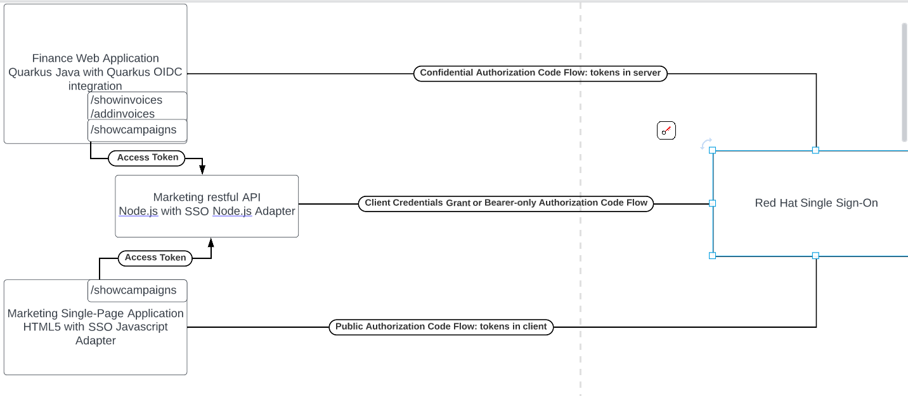
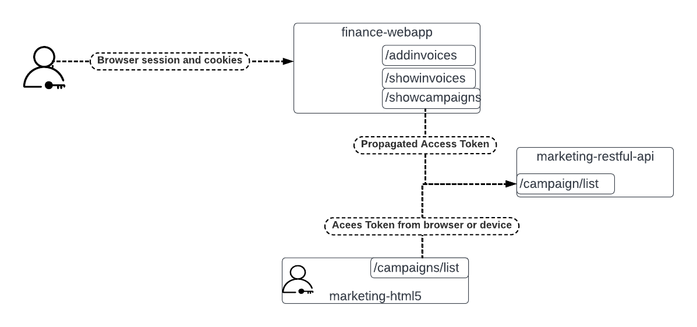

# do313-apps

* This repo have a directory for every GE in the book that need the applications in different states: only authentication, with authz with roles, with authz with oauth2 scopes...
* The student DOES NOT touch source code, only config files if needed
* These directories provide the applications that are deployed in the `/home/student/DO313/labs` directory of the `workstation` machine.

Start your RH-SSO server and import the provided realm JSON file from the Admin Console --> Add Realm.
It creates the realm, the alice user, and one client for each application.

 marketing-html5
 -----------------

 Based on https://github.com/keycloak/keycloak-quickstarts/tree/19.0.3/app-nodejs-html5

 Single Page Application served from a node.js wrapper.

To run:
 `cd marketing-html5 && npm run start`

It listen on http://localhost:8081/marketing-html5

marketing-restful-api
---------------------
Based on https://github.com/keycloak/keycloak-quickstarts/tree/19.0.3/service-nodejs

RESTful API made in Node.js.

To run:
`cd marketing-restful-api && npm run start`

It listen on http://localhost:3000/campaign

finance-webapp
--------------
Based on https://github.com/thackba/quarkus-qute-oidc-example
Web application (frontend+backend) made in Quarkus.

To run:

`cd finance-webapp && mvn quarkus:dev`

It listen on http://locahost:8080/finance

